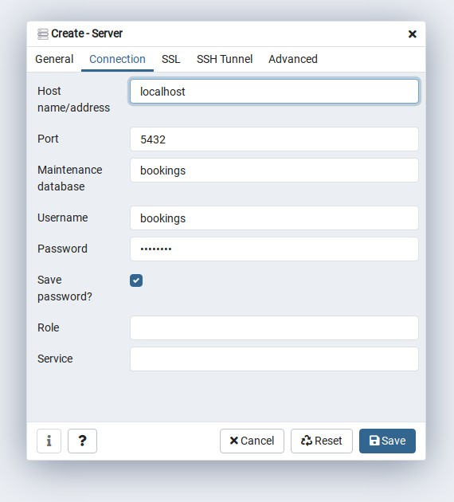

# Bookings and Reservations

The repository for [Building Modern Web Applications with Go](https://www.udemy.com/course/building-modern-web-applications-with-go/?referralCode=0415FB906223F10C6800).

- Built in Go version 1.15
- Uses the [chi router](github.com/go-chi/chi)
- Uses [alex edwards scs session management](github.com/alexedwards/scs)
- Uses [nosurf](github.com/justinas/nosurf)

## Install PostgreSQL

On Debian Linux, PostgreSQL can be installed with the following command:

```bash
# apt-get install postgresql postgresql-doc
```

Both the default database user and default database are called postgres

### Create a user and database for the system user

By default, Postgres uses a concept called “roles” to handle authentication and authorization.
After installation Postgres is set up to use ident authentication, meaning that it associates Postgres roles with a matching Unix/Linux system account.

Use su to swith to the postgres acount and create a user with the same name as the system user:

```
$ su -
# su -s /bin/bash postgres
postgres@debian:/root$ createuser -s username
```
The -s option grants superuser privileges.

Next we need to create a database for the user:

```bash
postgres@debian:/root$ createdb -O username username
```

Now try to start psql as a normal user:

```bash
$ psql
username=# \q
```

### Create bookings user and database

After setting up a user for the local system user, we no longer need to switch to the postgres account to run postgres commands.
Add an bookings postgres user:

```bash
$ createuser -P bookings
```

This creates an istagram user that is not allowed to create new databases or roles and is not superuser. The -P flag will display a password prompt to set a password for the user.

To create the bookings database, run the follwing command:

```bash
$ createdb -O bookings bookings 
```
### Install PGAdmin

[pgAdmin](https://www.pgadmin.org/) is a popular feature-rich open source database administration tool for PostgreSQL. 
Follow the instructions on the web site to install it.

On Debian Linux, pgAdmin is installed in `/usr/pgadnmin4`. Start pgAdmin and create a new Server by right-clicking on Servers and selecting Create -> Server...
The name should be localhost, switch to the connection tab and enter the required information:



## Install Soda

[Soda](https://gobuffalo.io/en/docs/db/getting-started/) (which is also called Pop) can be used to run SQL migrations.

To install Soda, run the following command:

```bash
$ go get github.com/gobuffalo/pop/...
```

Run soda from the Goland terminal:

```bash
$ soda -v
v5.3.1
```
If the output is `soda: command not found`, at it to `PATH`.

### Configure Soda

Copy the `database.yml.example` to `database.yml` and fill out username and password.

### Create users table

Run the following command to create a migrations file:

```bash
$ soda generate fizz CreateUserTable
v5.3.1

DEBU[2021-05-10T11:07:23+02:00] Step: 9bf35aef
DEBU[2021-05-10T11:07:23+02:00] Chdir: /home/johndoe/go/src/bookings
DEBU[2021-05-10T11:07:23+02:00] File: /home/johndoe/go/src/bookings/migrations/20210510090723_create_user_table.up.fizz
DEBU[2021-05-10T11:07:23+02:00] File: /home/johndoe/go/src/bookings/migrations/20210510090723_create_user_table.down.fizz
```
